## Data Augmentation Application

This application consists of a series of scripts that:

1. Extract images from the binary file of MNIST dataset;
2. Create a subset of MNIST by randomly choosing 50 samples for each digit called 50-MNIST;
3. Upscale the images from 50-MNIST, so we can fit the skeleton to their connected components;
4. Run data augmentation routine using the interactive SDMD software;
5. Scale down the generated samples to match 50-MINST image size;
6. Train a SVM on 50-MNIST and measure its performance on MNIST test dataset;
7. Train an SVM on the augmented 50-MNIST and measure its performance on the MNIST test dataset.

Before starting running the scripts, it needs to download the 4 binary files that consist of MNIST. It can be done on this [webpage](http://yann.lecun.com/exdb/mnist/). Save the files at the desired location.

### 1. Extract Images

First, we have to transform the binary files of MNIST into images. To do so, we can use the script *save_img.py*. It contains 3 adjustable variables that can be edited in the source code:

- **IN_TRAIN_IMAGES**: MNIST binary file that contains the images (samples) for training;

- **IN_TRAIN_LABELS**: MNIST binary file that contains the labels of the samples for training;

- **OUT_DIR**: The output directory, where the script will create the directory for the digits and the generated the PNG images for the digits.

### 2. Create 50-MNIST dataset

After extracting the image samples from MNIST, now, we randomly pick 50 samples for each digit. We can do it using the script *subset.py*. It contains 4 adjustable variables:

- **OUT_PATH**: Directory where the script will save the images;

- **IN_PATH**: Directory containing the images samples of MNIST. The one generated by *save_img.py*;

- **SEEDS**: A dictionary containing the seeds used to randomly drew samples for each digit;

- **NUM_SAMPLES**: Number of samples to be picked. For our experiment, it has to be set up as 50.

This script will generate 10 directories, one for each digit, in **OUT_PATH** directory containing 50 images sample of MNIST. This directory of the images is called **50-MNIST**.

### 3. Upscale images

Now, we have to upscale the images of 50-MNIST, so our software can successfully produce relevant skeletons that can be manipulated. To do so, we can use the script *scale_up.py*. It contains 3 adjustable variables:

- **UP_DIM**: The dimension that the image will be scaled up to. So, at the end, the image will be of dimensions: UP_DIM \times UP_DIM. For our experiment, it should be set up to 280;

- **ORIGINAL_DATASET**: Path for the dataset which is going to be scaled up. This path must contain a directory for each digit containing the images of the digit. For our experiment, it should be the directory generated by *subset.py*;

- **RESIZED_DIR**: Directory where the script will generate the up-scaled images.

The script will generate up scaled version of the images in ORIGINAL_DATASET and save them in RESIZED_DIR.

### 4. Data augmentation routine

Given the up-scaled images dataset generated in the previous step, we can now augment it using our interactive tool. To do so, we can run the script *data_augmentation_script_subset_50.py*. It contains 4 adjustable variables:

- **IN_DIR**: The directory that contains the dataset. Each digit has a directory containing its samples. In our experiment, this directory corresponds to the directory where the up scaled images were saved;

- **OUT_DIR**: The output directory where the augmented samples should be saved;

- **NUMBER OF SAMPLES**: A string containing the number of augmented samples that should be generated for each input sample;

- **INITIAL_INDEX**: The initial index is attached to the name of the generated augmented sample. 

In addition to these variables, the script also depends on the set-up of some required variables:

- **IN_FILES_$i$**: are lists containing batches of samples to be generated. It should contain the name without extension of the image files that are the input for the data augmentation. INFILES_$i$ contains the batch for the digit $i$, $i \in \{0, 1, \dots 9 \}$. 

The script also demands the set up of the position of some buttons and elements of the GUI of our interactive tool. For that, the tool should run maximised and the position of the circles in red should be set up at the variables associated if the letter closer to the circles as defined below:

- **A**: SPLINE_FITTING_PARAM_BUTTON_POS;

- **B**: RUN_BUTTON_POS;

- **C**: INTERP_CHKBOX_POS;

- **D**: MORPHOTREE_BUTTON_POS;

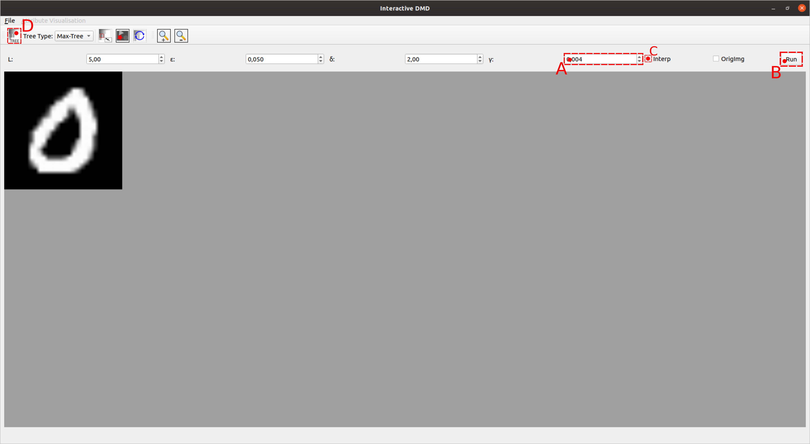

- **E**: ROOT_NODE_POS;

- **F**: SELECT_DESC_NODES_BUTTON_POS;

- **G**: SPLINE_MANIP_BUTTON_POS;

- **H**: VIS_CONTROL_POINTS_BUTTON_POS;

- **I**: TOP_LEFT_SPLINE_MANIP_REGION;

- **J**: BOTTOM_RIGHT_SPLINE_MANIP_REGION;

- **K**: RANDOM_CHANGES_BUTTON_POS;

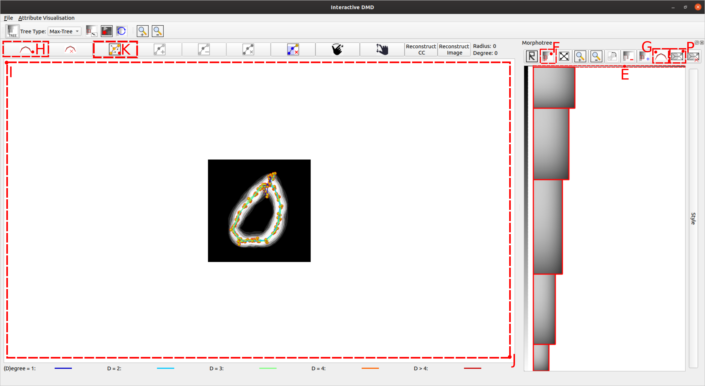

- **L**: OUTPUT_DIRECTORY_INPUT_POS;

- **M**: START_INDEX_INPUT_POS;

- **N**: NUMBER_OF_SAMPLES_INPUT_POS;

- **O**: GENERATE_MULTISAMPLE_BUTTON_POS;

- **P**: SPLINE_REC_BUTTON_POS.

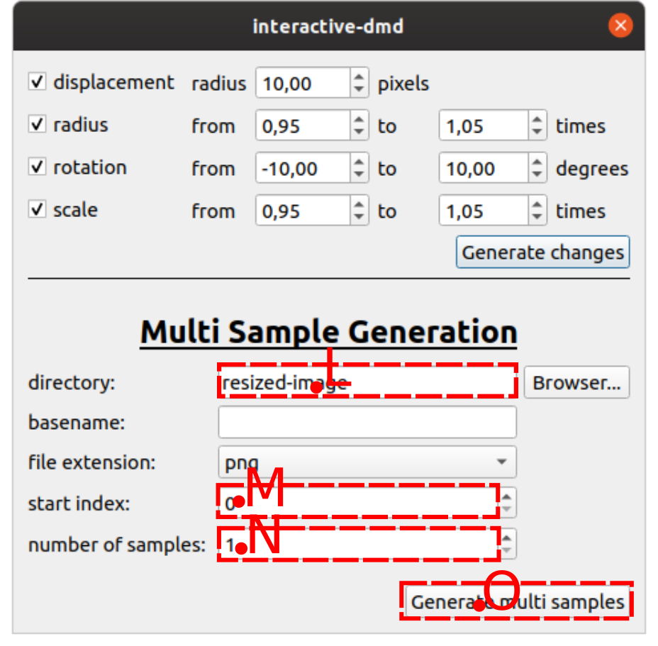

To run the script, two consoles should be opened, one where the script will be running and the other in the directory where the binary of the application is located. Then, when the script starts, the console in the directory of the binary of the application should be active (it is done manually). Then, the script runs to the end. When finished, the directory of the generated sampled (augmented dataset) should be produced.

#### 5. Scale down images

The samples of the augmented dataset will have the same dimension as the input samples. Since they are scaled up, they should be scaled down to match the dimension of the original dataset, so they can be used for training. To do so, we can run the script *resize/scale_down.py*. This script has 2 adjustable variables:

- **OUT_DIR**: The directory in which the scaled-down samples will be saved. They will be saved in the directory corresponding to their label (digit).

- **IN_DATASET**: The directory where the script should find the scaled-up samples. The directory should contain a subdirectory for each digit that contains the samples of the digit.

After the execution of the script, the OUT_DIRECTORY, should contain the scaled-down files.

#### 6. Train 50-MNIST SVM

After Step 5, everything is set up for the experiment. The script *train.py* can be used to train an SVM classifier on the dataset 50-MNIST. It has 3 adjustable variables:

- **IN_50_MNIST**: The path for the directory containing the samples of the 50-MNIST. The directory generated in Step 2, with the images of dimension $28 \times 28$;

- **TEST_SAMPLES**: The path for the binary file containing the MNIST testing dataset samples (download from the MNIST webpage);

- **TEST_LABELS**: The path for the binary file containing the MNIST testing dataset labels (download from the MNIST webpage);

During the excutation, the script should should the classifier report with Accuracy measures and the confusion matrix.

#### 7. Train 50-MNIST SVM

The script *train_50_aug.py* can be used to train an SVM classifier on the augmented  50-MNIST dataset. It has 4 adjustable variables:

- **IN_50_MNIST**: The path for the directory containing the samples of the 50-MNIST. The directory generated in Step 2, with the images of dimension 28 \times 28;

- **IN_AUG_50_MNIST**: The path for the directory containing the samples of the augmented samples. The directory generated in Step 2, with the images of dimension $28 \times 28$;

- **TEST_SAMPLES**: The path for the binary file containing the MNIST testing dataset samples (download from the MNIST webpage);

- **TEST_LABELS**: The path for the binary file containing the MNIST testing dataset labels (download from the MNIST webpage);

During the execution, the script should the classifier report with Accuracy measures and the confusion matrix.

### Screenshots of the scripts results

We have tested our approach in two different datasets: 50-MNIST and 15-EMNIST. Using the scripts provided, we took the screenshoot of the confustion matrices and classifier reports as shown next.

#### 50-MNIST

Classifier report tested on MNIST test dataset and trained on 50-MNIST (Classifier #1):

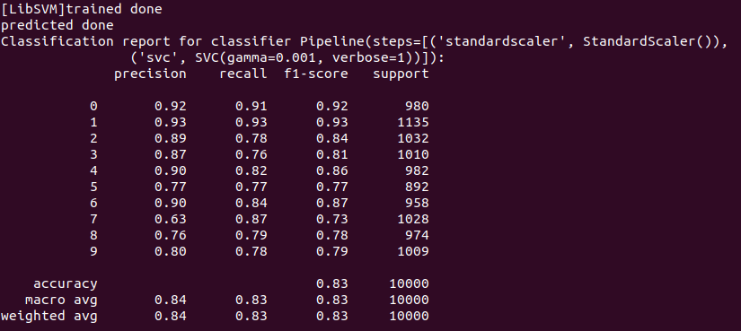

Classifier report tested on MNIST test dataset and trained on augmented 50-MNIST (Classifier #2):

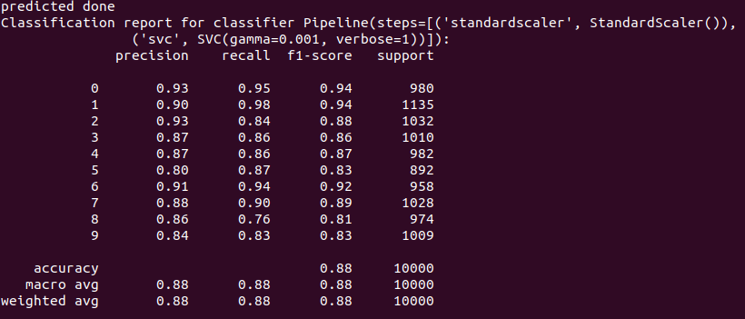

Confusion matrix of Classifier #1

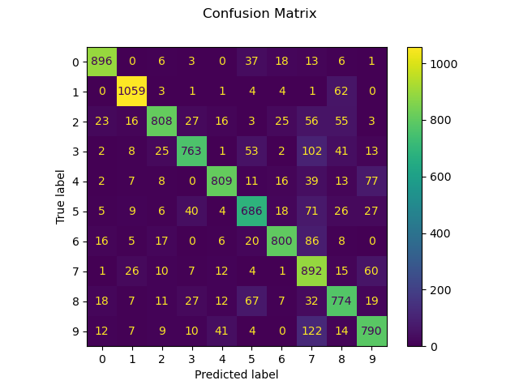

Confusion matrix of Classifier #2

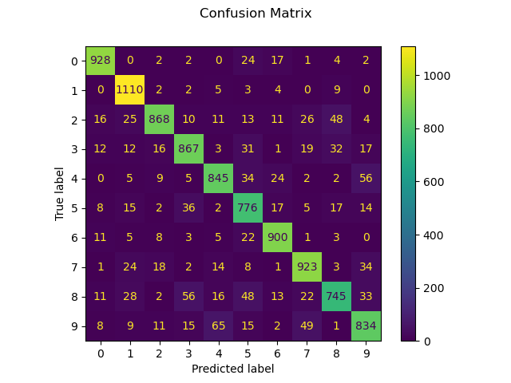

#### 15-EMNIST

Classifier report tested on EMNIST test dataset and trained on 15-EMNIST (Classifier #3):

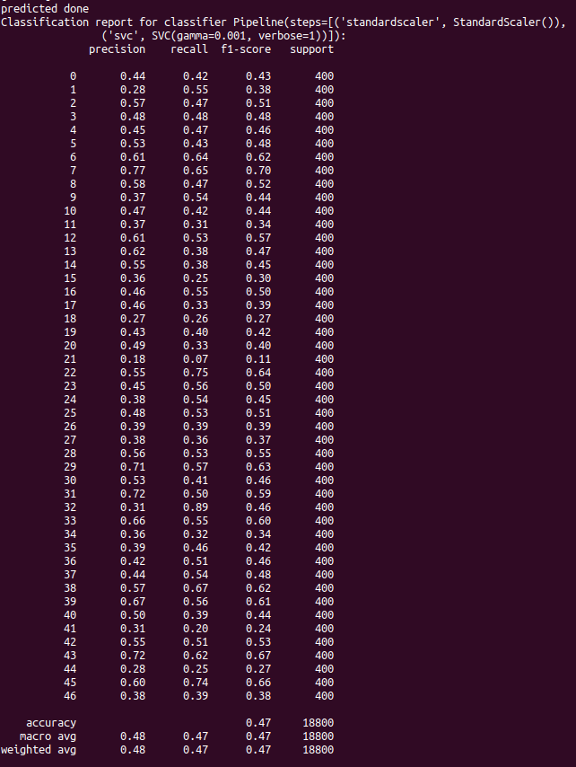

Classifier report tested on EMNIST test dataset and trained on augmented 15-EMNIST (Classifier #4):

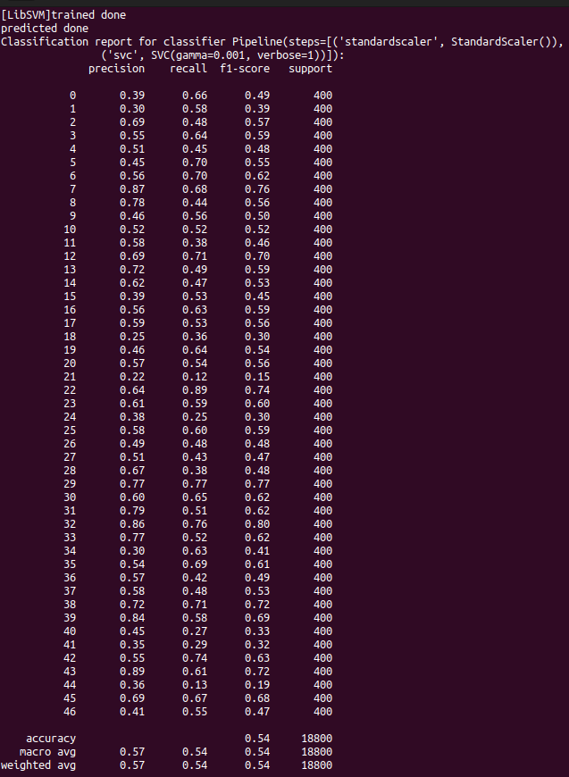

Confusion matrix of Classifier #3

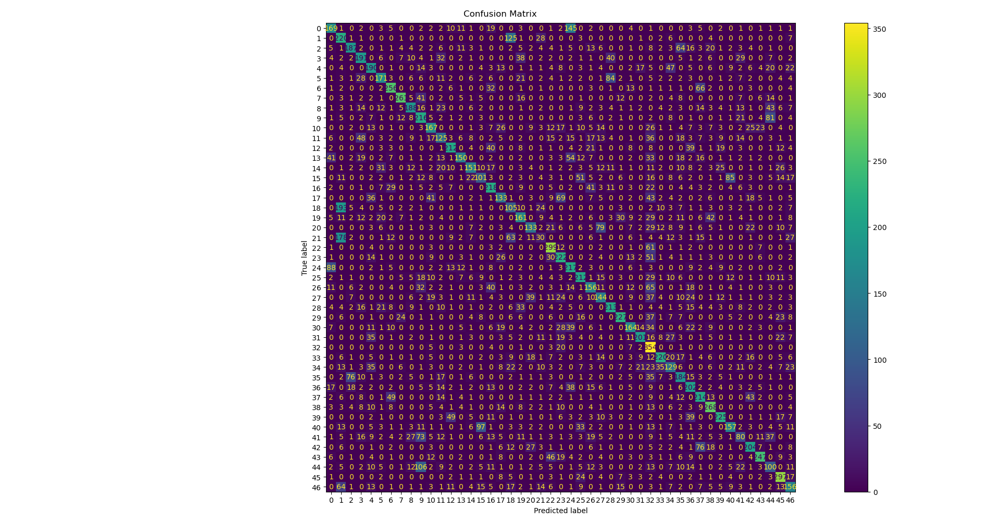

Confusion matrix of Classifier #4

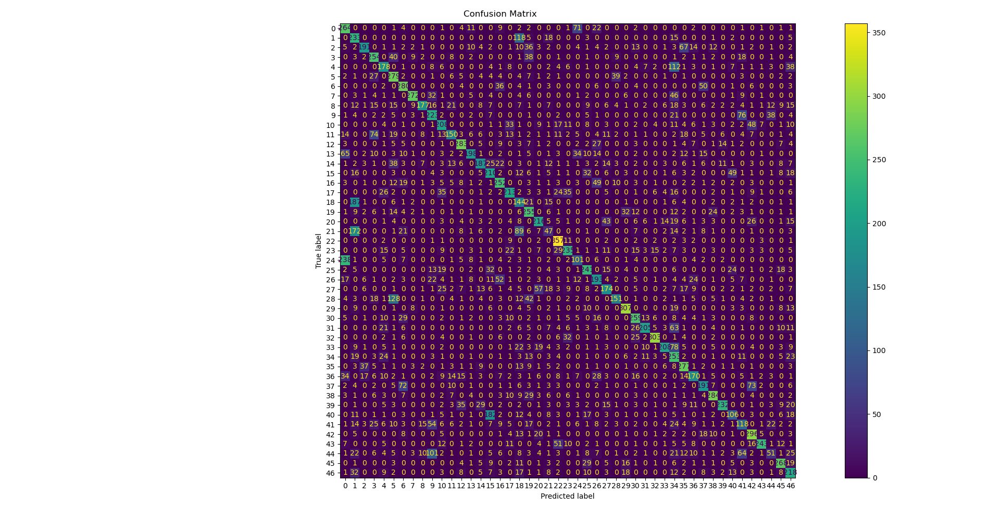
