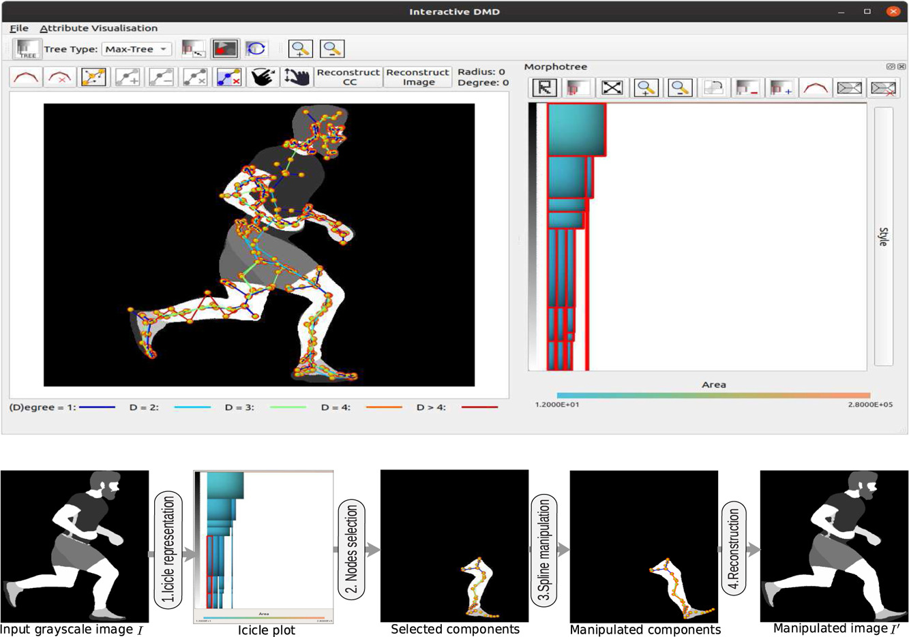

# Interactive image manipulation using morphological trees and spline-based skeletons
Jieying Wang, Dennis J. Silva, Jiri Kosinka, Alexandru Telea, Ronaldo F. Hashimoto, Jos B.T.M. Roerdink

## Abstract
The ability to edit an image using intuitive commands and primitives is a desired feature for any image editing software. In this paper, we combine recent results in medial axes with the well-established morphological tree representations to develop an interactive image editing tool that provides global and local image manipulation using high-level primitives. We propose a new way to render interactive morphological trees using icicle plots and introduce different ways of manipulating spline-based medial axis transforms for grayscale and colored image editing. Different applications of the tool, such as watermark removal, image deformation, dataset augmentation for machine learning, artistic illumination manipulation, image rearrangement, and clothing design, are described and showcased on examples.

## Supplementary material 
This supplementary material mainly shows several interactive image manipulation demos, as well as the source code.

### 1. Main application source code

The full source code is provided [here](https://github.com/dennisjosesilva/interactive-dmd).

### 2. Visible watermark removal

 We provide three demos for visible watermark removal, which can be found [here](./watermark).

### 3. Artistic effects

The demos of the black ball, the Y component of the tomato example and the copper ball image can be found [here](./illumination).

### 4. Binary image manipulation

A binary image manipulation example can be found [here](./ShapeManip/demo.mp4).

### 5. Image deformation

The manipulation of the running horse example can be found [here](./imageDeformation/horseManipulation.MOV).

### 6. Image rearrangement

The demo can be found [here](./rearrangement).

### 7. Tree navigation

An example of navigation on a  tree with hudreds of nodes using zooming and panning can be found [here](./tree-navigation/node-selection-zoom.mp4). 

### 8. Data augmentation

50-MNIST and 50-EMNIST data augmentation experiments details can be found [here](./DataAugmentation). 

### 9. Comparison with GIMP

Comparison of GIMP and our method for seven different applications can be found in this [link](./CompareWithGIMP).

### 10.Combination of our tools and GIMP

The demo of the combination of our tools and GIMP can be found [here](./Combination).

### 11. Runtime

Encoding runtime for a small dataset of different images can be found [here](./executionTimeAnalysis/time-analysis.ipynb).
